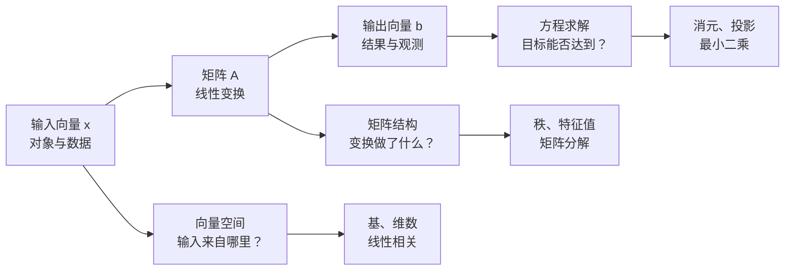
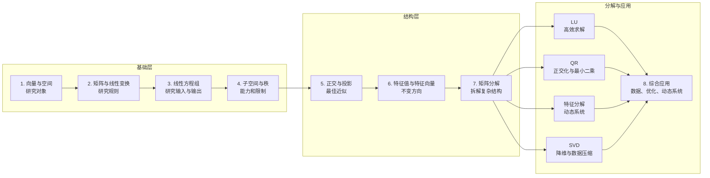

# 线性代数全局认知

我们不应一开始就陷入消元、行列式和公式计算，而应该先回答：

> 线性代数究竟研究什么？各部分为什么存在？它们之间怎样连接？

这一步先建立完整地图，之后再按地图逐个突破。

## 一条主线

线性代数研究的是：

> 如何用向量描述对象，用矩阵描述变换，并揭示高维空间中的结构。

整门课程可以围绕一个表达式展开：

$$
A\boldsymbol x=\boldsymbol b
$$

- $\boldsymbol x$：输入、未知量或原始数据。
- $A$：线性变换、系统规则或数据结构。
- $\boldsymbol b$：输出、观测结果或目标。
- 求解过程：研究输入怎样经过系统产生输出。

## 全局知识地图

## 八个知识领域

| 领域 | 核心问题 | 几何图像 | 典型用途 |
|---|---|---|---|
| 向量、基与维数 | 如何描述空间中的对象？ | 点、箭头、坐标轴 | 数据表示、物理状态 |
| 矩阵与线性变换 | 空间如何被旋转、拉伸或投影？ | 网格发生变形 | 图形学、坐标变换 |
| 线性方程组 | 给定输出，能否找到输入？ | 多个平面相交 | 电路、工程建模 |
| 子空间与秩 | 矩阵能产生什么，又会丢失什么？ | 平面被压成直线 | 冗余分析、可解性 |
| 正交与投影 | 无法精确求解时，怎样找到最近结果？ | 点向平面作垂线 | 拟合、回归、信号处理 |
| 行列式 | 变换怎样改变面积和体积？ | 正方形变为平行四边形 | 可逆性、积分换元 |
| 特征值与特征向量 | 哪些方向在变换中保持不变？ | 方向不变，只被缩放 | 稳定性、Markov 链 |
| 矩阵分解 | 怎样将复杂矩阵拆成简单操作？ | 旋转、缩放再旋转 | 求解、压缩、机器学习 |

## 一个例子贯穿全课程

考虑矩阵：

$$
A=
\begin{bmatrix}
2&1\\
1&2
\end{bmatrix}
$$

它可以从不同角度理解。

### 1. 列向量视角

$$
A\boldsymbol x
=
x_1
\begin{bmatrix}
2\\
1
\end{bmatrix}
+
x_2
\begin{bmatrix}
1\\
2
\end{bmatrix}
$$

矩阵乘向量是在组合矩阵的列。

### 2. 变换视角

矩阵把整个平面进行拉伸和旋转。单位正方形会变成由两列向量围成的平行四边形。

### 3. 方程视角

$$
A\boldsymbol x=\boldsymbol b
$$

这是在寻找哪个输入经过变换后会得到 $\boldsymbol b$。

### 4. 行列式视角

$$
\det A=2\cdot2-1\cdot1=3
$$

面积被放大为原来的 3 倍。因为行列式不为零，所以该变换可逆。

### 5. 特征视角

该矩阵有两个特殊方向：

$$
\begin{bmatrix}
1\\
1
\end{bmatrix},
\qquad
\begin{bmatrix}
1\\
-1
\end{bmatrix}
$$

它们经过变换后方向不变，只分别被放大 3 倍和 1 倍。这就是特征向量和特征值。

这说明列向量、方程组、行列式和特征值不是互不相干的章节，而是在观察同一个对象的不同侧面。

## 四种必须同时建立的视角

学习任何概念，都要从四个角度理解：

1. **代数视角**：公式如何计算？
2. **几何视角**：空间中发生了什么？
3. **结构视角**：它与基、维数、秩和子空间有什么关系？
4. **应用视角**：它解决什么真实问题？

例如“秩”：

- **代数视角**：主元的数量。
- **几何视角**：输出空间的维数。
- **结构视角**：独立行或独立列的最大数量。
- **应用视角**：系统真正包含多少独立信息。

只有四种解释能够互相转换，才算真正掌握。

## 后续突破顺序

接下来按六个阶段推进：

1. 向量、线性组合、基与维数。
2. 矩阵、线性变换与矩阵乘法。
3. 方程组、消元、秩与四个基本子空间。
4. 正交、投影、最小二乘与 QR 分解。
5. 行列式、特征值、对角化与动态系统。
6. SVD、伪逆、低秩近似与综合应用。

每个阶段都采用同一套学习闭环：

$$
\text{直觉图像}
\rightarrow
\text{具体例子}
\rightarrow
\text{数学定义}
\rightarrow
\text{公式推导}
\rightarrow
\text{手算练习}
\rightarrow
\text{实际应用}
\rightarrow
\text{综合检验}
$$

现有项目中的[中文图解教材](E:/Git-Space/The-Art-of-Linear-Algebra/The-Art-of-Linear-Algebra-zh-CN.tex#L69)可以作为视觉主教材，其中的[五种矩阵分解总览](E:/Git-Space/The-Art-of-Linear-Algebra/The-Art-of-Linear-Algebra-zh-CN.tex#L277)对应课程后半部分。

下一步进入第一阶段：从“向量究竟是什么”开始，彻底打通线性组合、张成空间、线性相关、基和维数。