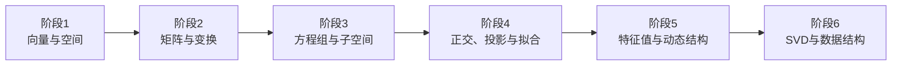

# 线性代数学习路线

这是一条逐层深入的认知链：

## 第一阶段：向量与空间

**核心问题：** 一个空间由哪些独立方向构成，以及怎样用这些方向表示空间中的所有对象？

理论内容包括向量运算、线性组合、张成空间、线性相关与无关、基、维数和坐标表示。

本阶段的逻辑链条是：

$$
\text{向量}
\rightarrow
\text{线性组合}
\rightarrow
\text{张成空间}
\rightarrow
\text{线性无关}
\rightarrow
\text{基}
\rightarrow
\text{维数}
$$

给定向量 $\boldsymbol v_1,\dots,\boldsymbol v_k$，它们的线性组合为：

$$
c_1\boldsymbol v_1+\cdots+c_k\boldsymbol v_k
$$

所有线性组合构成张成空间。若某个向量能够由其他向量表示，则这组向量存在冗余，即线性相关。

例如：

$$
\begin{bmatrix}
2\\
4
\end{bmatrix}
=
2
\begin{bmatrix}
1\\
2
\end{bmatrix}
$$

这两个向量只能张成一条直线，不能构成 $\mathbb R^2$ 的基。

基是一组既能张成整个空间、又线性无关的向量；维数是基向量的数量。同一个向量在不同基下具有不同坐标，因此：

$$
\boxed{\text{向量不变，坐标随基改变}}
$$

**用途：** 数据表示、坐标系统、冗余检测，以及为矩阵、秩、特征向量和降维建立基础。

**过关标准：** 能判断向量组的张成空间、线性相关性和是否构成基，并能解释基、坐标与维数的关系。

## [第二阶段：矩阵与线性变换](stage_2_matrices_and_linear_transformations.md)

**核心问题：** 一个空间中的对象，怎样按照统一规则变成另一个对象？

理论内容包括矩阵乘向量、矩阵乘法、线性映射、旋转、缩放、剪切、投影、逆矩阵、复合变换和换基。

最关键的公式是：

$$
A\boldsymbol x
=
x_1\boldsymbol a_1+\cdots+x_n\boldsymbol a_n
$$

它说明矩阵乘向量，就是用输入坐标组合矩阵的列；矩阵第 $j$ 列，就是第 $j$ 个基向量变换后的结果。

例如：

$$
A=
\begin{bmatrix}
2&1\\
0&1
\end{bmatrix}
$$

它把 $\boldsymbol e_1$ 变成 $(2,0)$，把 $\boldsymbol e_2$ 变成 $(1,1)$。几何上，它同时进行了水平拉伸和剪切，单位正方形会变成平行四边形。

矩阵乘法满足：

$$
AB\boldsymbol x=A(B\boldsymbol x)
$$

因此，$AB$ 表示先执行 $B$，再执行 $A$。这也解释了为什么通常 $AB\neq BA$：变换顺序不同，结果不同。

**用途：** 计算机图形学、机器人坐标转换、神经网络、物理系统和数据变换。

**过关标准：** 看到一个二维矩阵时，能够根据它的列画出空间网格如何变化，并能从一个给定变换写出矩阵。

## [第三阶段：方程组、消元、秩与子空间](stage_3_systems_elimination_rank_and_subspaces.md)

**核心问题：** 给定目标 $\boldsymbol b$，是否存在输入 $\boldsymbol x$，使 $A\boldsymbol x=\boldsymbol b$？

理论内容包括高斯消元、行阶梯形、主元、自由变量、齐次方程、特解、列空间、行空间、零空间、左零空间、秩和秩—零度定理。

$$
A\boldsymbol x=\boldsymbol b
$$

方程有解，当且仅当 $\boldsymbol b$ 位于 $A$ 的列空间中。若 $\boldsymbol x_p$ 是一个特解，那么所有解具有结构：

$$
\boldsymbol x=\boldsymbol x_p+\boldsymbol x_n,
\qquad
\boldsymbol x_n\in N(A)
$$

四个基本子空间分别回答：矩阵能产生哪些输出、保留哪些输入信息，以及哪些方向会被完全消除。

$$
\operatorname{rank}(A)+\operatorname{nullity}(A)=n
$$

例如，一个 $3\times5$ 矩阵的秩为 3，则零空间维数为 2，意味着输入中存在两个不会影响输出的自由方向。

**用途：** 工程方程求解、网络流、电路分析、约束系统和数据冗余检测。

**过关标准：** 能从行最简形直接读出秩、自由变量、解空间和各子空间的一组基，并能解释方程为什么无解、存在唯一解或有无穷多解。

## [第四阶段：正交、投影、最小二乘与 QR](stage_4_orthogonality_projection_least_squares_and_qr.md)

**核心问题：** 当目标无法精确到达时，怎样找到最接近的可实现结果？

理论内容包括内积、长度、夹角、正交、正交补、标准正交基、Gram–Schmidt、正交投影、最小二乘和 QR 分解。

向量 $\boldsymbol b$ 在 $\boldsymbol a$ 上的投影为：

$$
\operatorname{proj}_{\boldsymbol a}\boldsymbol b
=
\frac{\boldsymbol a^\mathsf T\boldsymbol b}
{\boldsymbol a^\mathsf T\boldsymbol a}\boldsymbol a
$$

当 $A\boldsymbol x=\boldsymbol b$ 无解时，寻找：

$$
\min_{\boldsymbol x}\|A\boldsymbol x-\boldsymbol b\|^2
$$

最佳结果 $A\hat{\boldsymbol x}$ 是 $\boldsymbol b$ 在列空间上的投影。残差与列空间正交，因此：

$$
A^\mathsf TA\hat{\boldsymbol x}
=
A^\mathsf T\boldsymbol b
$$

QR 分解 $A=QR$ 把列空间转换成一组标准正交基，使投影和最小二乘计算更加稳定。

**用途：** 线性回归、曲线拟合、信号处理、定位估计和数值计算。

**过关标准：** 能推导正规方程、完成 Gram–Schmidt 正交化、计算投影，并解释“最小二乘为什么就是投影”。

## [第五阶段：行列式、特征值与动态结构](stage_5_determinants_eigenvalues_diagonalization_and_dynamics.md)

**核心问题：** 一个变换怎样改变空间尺度？哪些方向在变换中保持不变？

行列式满足：

$$
|\det A|
=
\text{面积或体积的缩放倍数}
$$

若 $\det A=0$，空间被压缩到更低维，矩阵不可逆。行列式的正负还表示空间定向是否翻转。

特征向量满足：

$$
A\boldsymbol v=\lambda\boldsymbol v
$$

它经过变换后方向不变，只被缩放 $\lambda$ 倍。若矩阵可以对角化：

$$
A=P\Lambda P^{-1},
\qquad
A^k=P\Lambda^kP^{-1}
$$

这意味着在特征向量组成的坐标系中，复杂变换只是各个方向上的独立缩放。

本阶段还要掌握特征多项式、特征空间、代数重数、几何重数、相似变换、对角化、对称矩阵、谱定理、二次型和正定性。

对称矩阵具有尤其清晰的结构：

$$
A=Q\Lambda Q^\mathsf T
$$

**用途：** 动态系统稳定性、Markov 链、振动模式、微分方程、搜索排序和优化。

**过关标准：** 能判断矩阵是否可对角化，使用特征分解计算矩阵幂，并根据特征值预测系统的长期行为。

## [第六阶段：SVD、伪逆、低秩近似与数据分析](stage_6_svd_pseudoinverse_low_rank_and_data_analysis.md)

**核心问题：** 任意矩阵最本质的作用方向是什么？矩阵中真正有效的信息有多少？

任意 $m\times n$ 矩阵都可以分解为：

$$
A=U\Sigma V^\mathsf T
$$

其几何过程是：

1. 由 $V^\mathsf T$ 旋转或反射输入空间；
2. 由 $\Sigma$ 沿正交方向缩放；
3. 由 $U$ 旋转或反射输出空间。

奇异值表示各个方向的信息强度；零奇异值对应被完全消除的方向；很小的奇异值意味着该方向对误差非常敏感。

SVD 会把秩、四个基本子空间和数值稳定性统一起来。

伪逆为：

$$
A^+=V\Sigma^+U^\mathsf T
$$

它可以处理非方阵、不可逆矩阵和没有精确解的方程。

保留最大的 $k$ 个奇异值，可以得到最佳秩 $k$ 近似：

$$
A_k=U_k\Sigma_kV_k^\mathsf T
$$

**用途：** PCA、图像压缩、推荐系统、降维、去噪、语义分析和稳定最小二乘。

**过关标准：** 能解释 SVD 的几何意义，识别四个基本子空间，计算简单伪逆，并说明截断 SVD 为什么能够保留主要信息。

## 最终目标

完成六个阶段后，最终能力不是“记住六组公式”，而是能够在五种语言之间自由转换：

$$
\boxed{
\text{方程组}
\leftrightarrow
\text{矩阵}
\leftrightarrow
\text{线性变换}
\leftrightarrow
\text{子空间}
\leftrightarrow
\text{矩阵分解}
}
$$

后续教学将按照以下顺序逐阶段突破：

> 直觉图像 → 数值例子 → 数学定义 → 公式推导 → 练习 → 应用 → 检验
